# Chapter 07: Tool Manipulation and Orchestration Agents

This module implements the third triad of AI agents described in *30 Agents Every AI Engineer Must Build* (Chapter 7). It covers how single and multi-agent systems translate abstract natural language reasoning into grounded, real-world execution through tool invocation, multi-specialist orchestration, and resilient business process state machines.

---

## Agent Architecture and State Workflows

```mermaid
flowchart TD
    subgraph S1["Agent 07: Tool-Using Pattern"]
        T1[User Natural Language Request] --> T2[Reasoning Core: Think & Plan]
        T2 --> T3[(Tool Registry & Contracts)]
        T3 --> T4[Execution Engine: Act]
        T4 --> T5[Guarded Tool Chest: CSV / Agg / Matplotlib]
        T5 --> T6[Rendered Asset / Action Output]
    end

    subgraph S2["Agent 08: Chain-of-Agents Orchestrator"]
        O1[Lead Orchestrator Manager] --> O2[Specialist: NewsAgent]
        O1 --> O3[Specialist: FinancialAgent]
        O1 --> O4[Specialist: SentimentAgent]
        O2 & O3 & O4 --> O5[(Working & Episodic Memory)]
        O5 --> O6{"Conflict Detector: abs(Sentiment - Move) > Threshold"}
        O6 -->|Divergence Found| O7[LLM Arbiter Reconciliation]
        O6 -->|Aligned| O8[Direct Consensus Report]
    end

    subgraph S3["Agent 09: Agentic Workflow System"]
        W1[Intake State] --> W2[Validation Guard]
        W2 -->|Valid| W3[Risk Assessment LLM Node]
        W2 -->|Invalid| W7[Closed: Rejected]
        W3 -->|High Conf & Low Risk| W5[Processing Payout]
        W3 -->|Low Conf or High Risk| W4{HITL Review Gate}
        W4 -->|Approved| W5
        W4 -->|Rejected| W7
        W5 --> W6[Closed: Approved]
    end
```



---

## Agent Triad Breakdown

| # | Agent Name | Core Architectural Pattern | Capability Level | Key Technologies |
| :--- | :--- | :--- | :--- | :--- |
| **07** | **The Tool-Using Agent** | Think-Plan-Act cycle with typed Pydantic contracts and error fallbacks | Level 2 (Tool-Using Agent) | Google GenAI SDK, Pandas, Matplotlib, Pydantic |
| **08** | **The Chain-of-Agents Orchestrator** | Multi-specialist task delegation, layered working/episodic memory, and automated arbitration | Level 3 (Planning & Orchestrator Agent) | Gemini 2.5 Flash, Episodic Logs, Mathematical Divergence Scoring |
| **09** | **The Agentic Workflow System** | Deterministic Finite State Machine (FSM) with embedded LLM reasoning nodes and Human-in-the-Loop gates | Level 3–4 (Governed Agentic Systems) | Finite State Machines, HITL Checkpoints, Audit Trails |

---

## Repository Structure

```text
chapter_07_tool_orchestration_agents/
├── .env.example
├── .gitignore
├── requirements.txt
├── README.md
├── 07_tool_using_agent/
│   ├── agent.py
│   ├── tools.py
│   └── main.py
├── 08_chain_of_agents_orchestrator/
│   ├── memory.py
│   ├── specialists.py
│   ├── orchestrator.py
│   └── main.py
└── 09_agentic_workflow_system/
    ├── state_machine.py
    ├── workflow.py
    └── main.py
```

---

## Setup and Installation

### 1. Environment Configuration

```bash
# Create and activate virtual environment
python3 -m venv .venv
source .venv/bin/activate

# Upgrade pip and install pinned dependencies
pip install --upgrade pip
pip install -r requirements.txt
```

### 2. Configure API Keys

```bash
cp .env.example .env
```

Edit `.env` and configure your API key:

```env
GOOGLE_API_KEY="your_actual_gemini_api_key"
```

---

## Execution Instructions

* **Run Agent 07 (Tool-Using Visualization Agent):**
```bash
python 07_tool_using_agent/main.py
```

* **Run Agent 08 (Multi-Agent Market Arbiter):**
```bash
python 08_chain_of_agents_orchestrator/main.py
```

* **Run Agent 09 (Insurance Claims FSM Workflow with HITL):**
```bash
python 09_agentic_workflow_system/main.py
```

---

## Deep Engineering Principles

### 1. Function Calling as Strict Interface Contracts
Tools are not informal script invocations; they are governed by deterministic Pydantic schemas. This enforces compile-time and runtime validation on all parameter payloads passed between the LLM Reasoning Core and physical tools.

### 2. Multi-Agent Memory & Signal Arbitration
Specialist agents remain stateless micro-functions while the central orchestrator maintains state across two distinct memory tiers:
* **Working Memory:** The immediate execution scratchpad.
* **Episodic Memory:** A timestamped audit log of all inter-agent messages.

When specialist outputs diverge (e.g., public sentiment diverges from quantitative stock performance by more than $0.5$ on a normalized $[-1, 1]$ scale), an Arbiter Agent is dynamically engaged to reconcile conflicting signals before final synthesis.

### 3. FSM Governance and Human-in-the-Loop Safety
Critical enterprise operations must avoid unbounded autonomy. The state machine enforces strict guard conditions: claims below $0.85$ confidence or above financial risk thresholds automatically halt the transition pipeline and route to human operators for review before any settlement action is executed.
